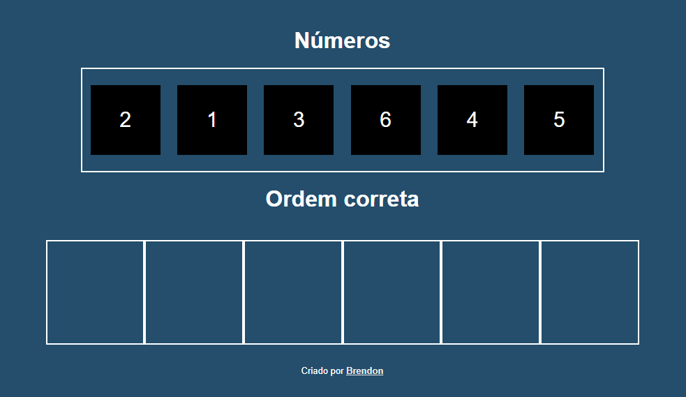
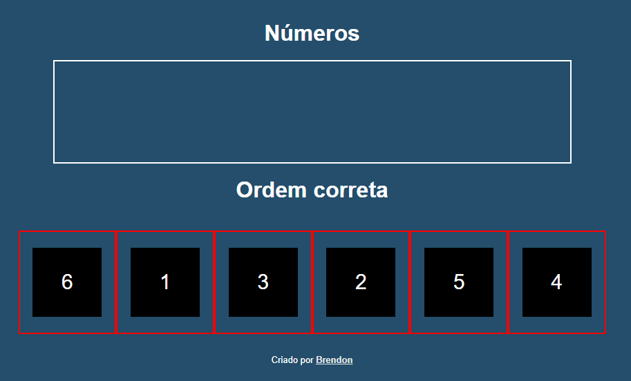
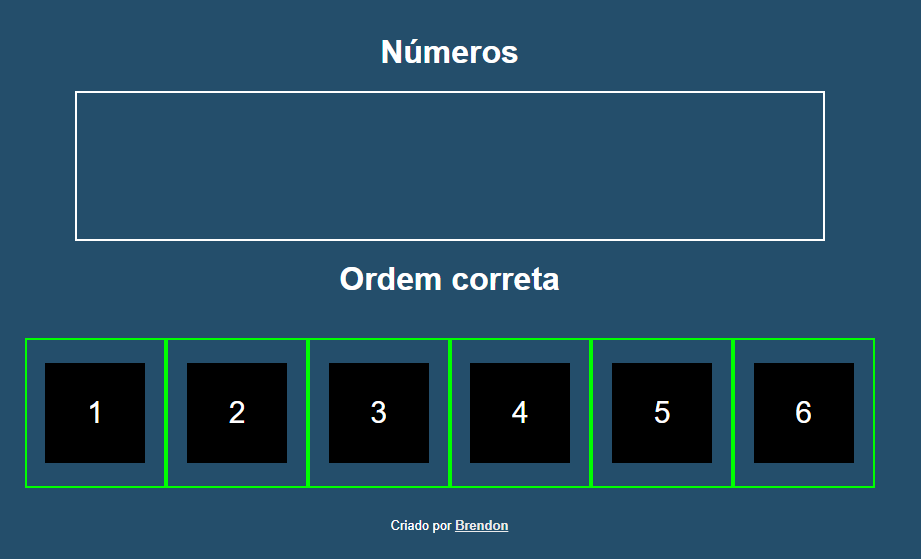

# Quebra Cabeças com Arrasta e Solta

Apenas um projeto de exemplo com arrasta e solta que fiz.
A cor da borda muda de acordo com a ordem, se está correta ou não.  

Consegui entender mais sobre as condicionais e atributos, pois foi o que mais usei para este projeto.

# Imagens do projeto
Tela inicial 

Ordem errada

Ordem correta

